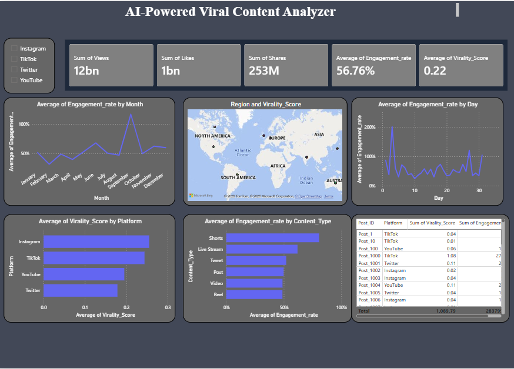

# AI-Powered Viral Content Analyzer

## Project Overview
This project is an end-to-end data analytics and machine learning solution designed to understand and predict what makes social media content go viral.

It combines data cleaning, exploratory analysis, interactive visualization, and an AI-powered prediction system built with Streamlit. The goal is to transform raw engagement data into actionable insights and a usable prediction tool.

---

## Problem Statement
With the rapid growth of social media platforms, understanding what drives content virality has become critical for creators and marketers.

However, most decisions are still based on intuition rather than data.

This project aims to:
- Identify patterns behind high-performing content
- Analyze engagement behavior across platforms
- Build a system that can predict the likelihood of content going viral

---

## Dataset Description
The dataset contains social media performance metrics, including:

- Views
- Likes
- Shares
- Engagement Rate
- Virality Score
- Platform (Instagram, TikTok, YouTube, Twitter)
- Content Type (Post, Reel, Shorts, Video, etc.)
- Date / Time-related attributes
- Region-based data

---

## Project Workflow

### 1. Data Cleaning & Preprocessing
- Removed missing and inconsistent values
- Standardized column formats
- Converted numerical and categorical data appropriately
- Ensured dataset quality for analysis and modeling

---

### 2. Exploratory Data Analysis (EDA)
Performed in-depth analysis to uncover patterns:

- Engagement trends across months and days
- Platform-wise performance comparison
- Content-type effectiveness analysis
- Relationship between engagement metrics and virality score

Key focus:
Understanding *what actually drives virality*

---

### 3. Power BI Dashboard Development
An interactive dashboard was built to make insights easily accessible.

#### Dashboard Features:
- KPI Cards:
  - Total Views (12bn+)
  - Total Likes (1bn+)
  - Total Shares (253M+)
- Engagement trends over time (monthly & daily)
- Region-wise virality visualization (map)
- Platform comparison (Instagram, TikTok, YouTube, Twitter)
- Content type performance analysis
- Interactive slicers for platform filtering

---

## Dashboard Preview



---

### 4. Machine Learning Model
A predictive model was developed to estimate content virality.

#### Steps:
- Selected relevant features (likes, shares, engagement rate, etc.)
- Split data into training and testing sets
- Trained model using Scikit-learn
- Evaluated performance using appropriate metrics

#### Outcome:
- Model capable of estimating virality score based on input features
- Helps in predicting content performance before publishing

---

### 5. AI-Powered Streamlit Application
To make the model usable, a Streamlit web app was built.

#### Features:
- User inputs:
  - Likes
  - Shares
  - Views
  - Engagement rate
- Real-time prediction of virality score
- Simple and interactive UI

#### Purpose:
Bridges the gap between analysis and real-world usability

---

## Tech Stack

**Languages & Libraries**
- Python (Pandas, NumPy, Scikit-learn)

**Visualization**
- Power BI

**Deployment / Interface**
- Streamlit

**Other Tools**
- Jupyter Notebook

---

## Key Insights

- Higher engagement rate strongly correlates with higher virality
- Short-form content (Reels, Shorts) consistently outperforms long-form content
- Platform choice significantly impacts reach and engagement
- Certain time periods show spikes in engagement
- Shares contribute more to virality than likes alone

---

## How to Run the Project

### 1. Clone the repository
```bash
git clone https://github.com/gayathrisatish13/ai-viral-content-analyzer.git
cd ai-viral-content-analyzer
